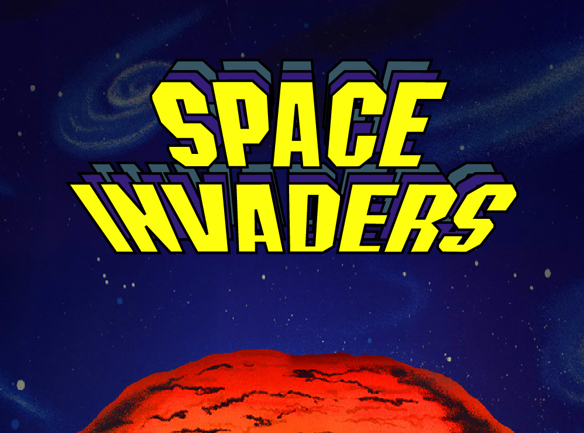

# Space Invaders

------



**Space Invaders** est un shoot 'em up fixe en deux dimensions. Le joueur contrôle un vaisseau, qu'il peut déplacer sur l'axe x et y. ... L'objectif est de détruire avec le canon laser une vague ennemie, avant qu'elle n'atteigne le bas de l'écran.

Les règles sont simples, le joueur dispose de 5 cœurs, un cœur est perdu à chaque ennemie atteignant le bas de d'écran, le vaisseau du joueur possède également une barre de vie. En clair, il existe deux moyens de perdre, l'une est la perte de la totalité des cœurs, l'autre, la destruction du vaisseau.

Le jeu se joue exclusivement avec les touches ZQSD ou les flèches du pavé numérique du clavier pour vous déplacer et la touche ESPACE pour tirer.

Vous pouvez voir le score des autres joueurs du monde en cliquant sur le trophée en bas de l'écran d'accueil.

Si vous souhaitez retourner sur la page d'accueil appuyer sur la touche échappe.


## Installation du jeu

------

- Cloner le projet en local

- Ouvrir le projet avec un IDE

- Installer les dépendances du jeu

  - ```bash
    pip install pygame
    pip install mysql-connector-python
    ```

- Lancer le jeu

  - ```
    py main.py
    ```